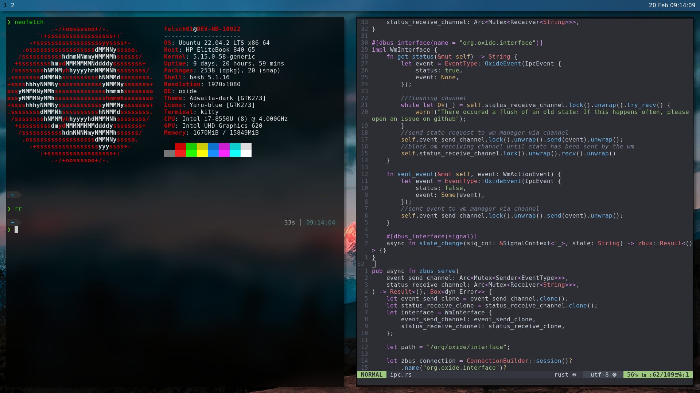

# OxideWM


[](https://github.com/DHBW-FN/OxideWM/actions/workflows/rust_test.yml)
<!-- -->



## What is Oxide?
OxideWM is a X11 dynamic tiling window manager written in Rust.
This project idea is inspired by the DWM, leftWM and i3WM.
Oxide supports a dynamic config, IPC and multiple tiling modes.
Take a look at our [readthedocs](oxide.readthedocs.org) to see the full documentation.

## Prerequisits
Rust needs to be installed. After installation restart the terminal session, that the new environment variables are loaded.
```bash
curl --proto '=https' --tlsv1.2 -sSf https://sh.rustup.rs | sh
```

Build tools need to be install:
```bash
# Ubuntu
sudo apt install git make build-essential libglib2.0-dev libcairo2-dev libpango1.0-dev kitty
```

## Installation

1. Clone the Oxide git repository:

```bash
git clone https://github.com/DHBW-FN/OxideWM.git
```

2. Install Oxide via make:

```bash
cd OxideWM
make install
```

Sudo privileges are required to install Oxide.
After installation you can quit your current X session and log out. Subsequently Oxide should be selectable as window manager in your login screen.

## Run Oxide locally (Debug)

To run oxide locally, xephyr is used to emulate a seperate X-server.
```bash
make run
```

## Documentation

- [OxideWM - ReadTheDocs](https://oxide.readthedocs.io/en/latest/)

## Logging

To change log level, set environment variable `OXIDE_LOG=[error, info, debug, trace]` changes affect only after restart... .
Logs will always be written to `/var/log/syslog`.
When project is built without `--release` flag, the logs are additionally written to `stdout` and to `log/*.log`.
