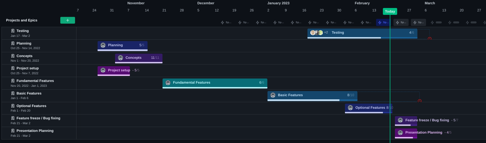

.. _work_package_plan:

=================
Work package plan
=================

+-----------------------------+------------------+
| Title                       | Duration [weeks] |
+=============================+==================+
| Planning                    | 3                |
+-----------------------------+------------------+
| Project setup               | 2                |
+-----------------------------+------------------+
| Concepts                    | 3                |
+-----------------------------+------------------+
| Fundamental features        | 6                |
+-----------------------------+------------------+
| Basic features              | 5                |
+-----------------------------+------------------+
| Testing                     | 6                |
+-----------------------------+------------------+
| Desired features            | 3                |
+-----------------------------+------------------+
| Feature freeze / bug fixing | 2                |
+-----------------------------+------------------+
| Presentation planning       | 2                |
+-----------------------------+------------------+

.. hint::
    If the work package plan is not shown big enough to read, please click on it.

    work package plan 

