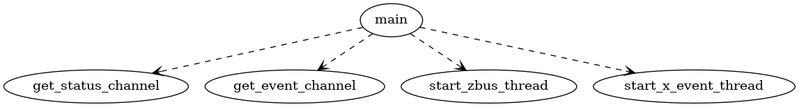
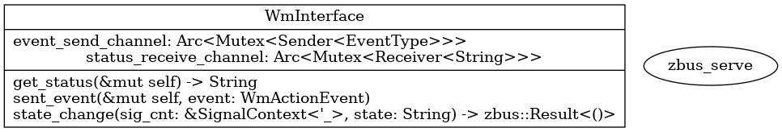
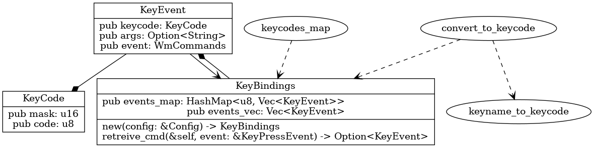
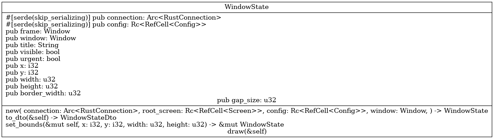

.. _general:

=======
General
=======

.. hint::
    If the diagrams are not shown big enough to read, please click on them.

Main
----

    main

Auxiliary
---------

    auxiliary

Inter process communication (IPC)
---------------------------------

    IPC

Keybindings
-----------

    keybindings

Windowstate
-----------

    windowstate