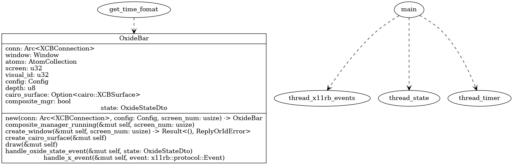
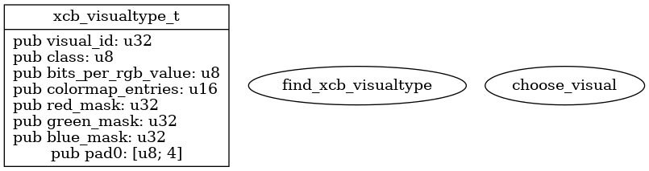
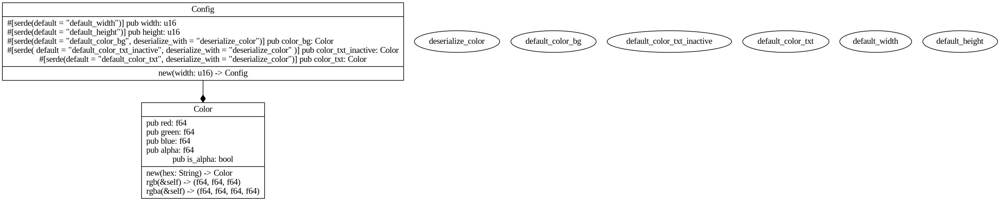

.. _docs_source_033_class_diagrams_generated_extensions_oxide-bar:

========================================================
oxide-bar
========================================================

.. hint:: If the diagrams are not shown big enough to read, please click on them.

main
-------------------------------------------------------------------------------------

    main.png

xcb visualtype
-------------------------------------------------------------------------------------

    xcb_visualtype.png

config
-------------------------------------------------------------------------------------

    config.png

