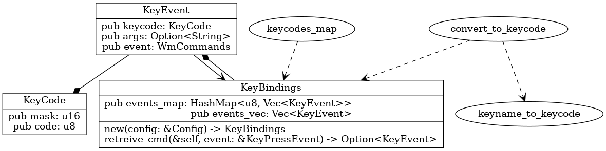
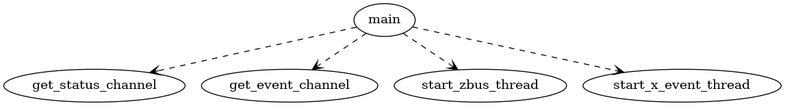
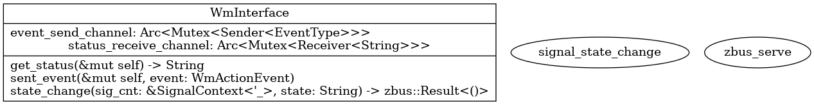
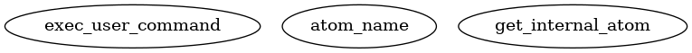
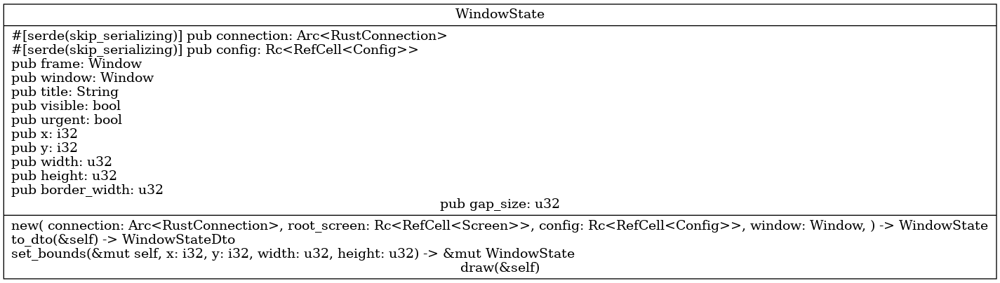

.. _docs_source_033_class_diagrams_generated_windowmanager:

========================================================
windowmanager
========================================================

All shown class diagrams are **automatically generated**.

.. toctree::
        :maxdepth: 3

        screeninfo/index
        setup/index
        eventhandler/index
        config/index
        windowmanager/index
        workspace/index

.. hint:: If the diagrams are not shown big enough to read, please click on them.

keybindings
-------------------------------------------------------------------------------------

    keybindings.png

main
-------------------------------------------------------------------------------------

    main.png

ipc
-------------------------------------------------------------------------------------

    ipc.png

auxiliary
-------------------------------------------------------------------------------------

    auxiliary.png

windowstate
-------------------------------------------------------------------------------------

    windowstate.png

