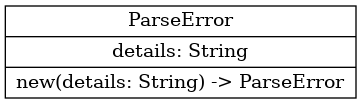
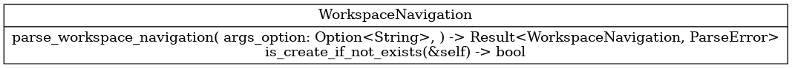
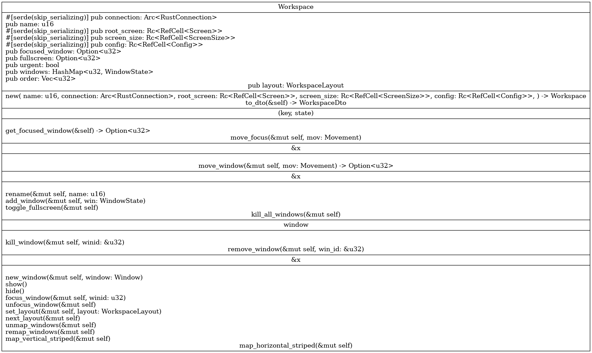

.. _docs_source_033_class_diagrams_generated_windowmanager_workspace:

========================================================
workspace
========================================================

.. hint:: If the diagrams are not shown big enough to read, please click on them.

parse_error.png
-------------------------------------------------------------------------------------

    parse_error.png

workspace_navigation.png
-------------------------------------------------------------------------------------

    workspace_navigation.png

mod.png
-------------------------------------------------------------------------------------

    mod.png

