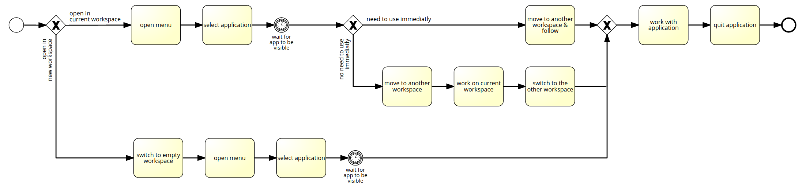
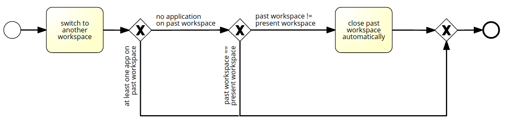
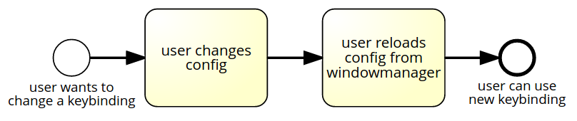

.. _components:

================================
Components and behavior diagrams
================================
The individual components and their behavior in certain situations are shown below.

.. hint::
    If the diagrams are not shown big enough to read, please click on them.

Components
----------

.. figure:: ../../../../planning/diagrams/components.png
    :align: center
    :width: 80%

    components

Change request
--------------

.. figure:: ../../../../planning/diagrams/behaviour_change_request.png
    :align: center
    :width: 80%

    behaviour while incoming change request

New application
---------------

.. figure:: ../../../../planning/diagrams/behaviour_new_application.png
    :align: center
    :width: 80%

    behaviour when new application is demanded

New application user perspective
--------------------------------

    behaviour when new application is demanded from the user perspective

Switch workspace user perspective
---------------------------------

    behaviour when a new workspace is selected from the user perspective

Switch workspace user perspective
---------------------------------

    behaviour what happens during a config change from the user perspective
