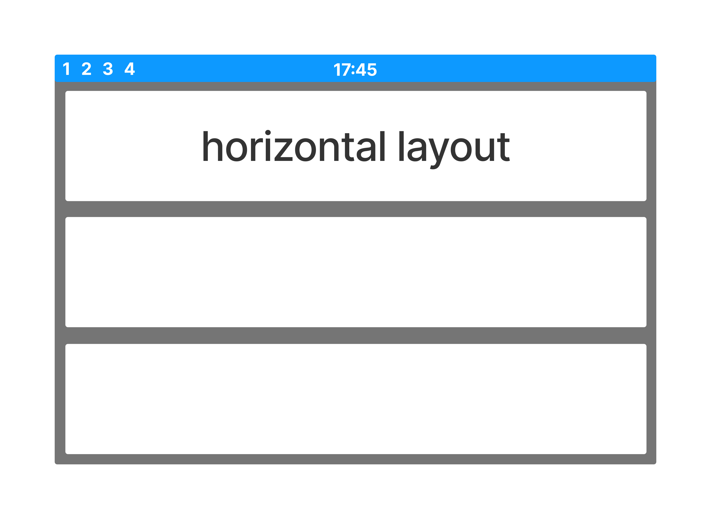
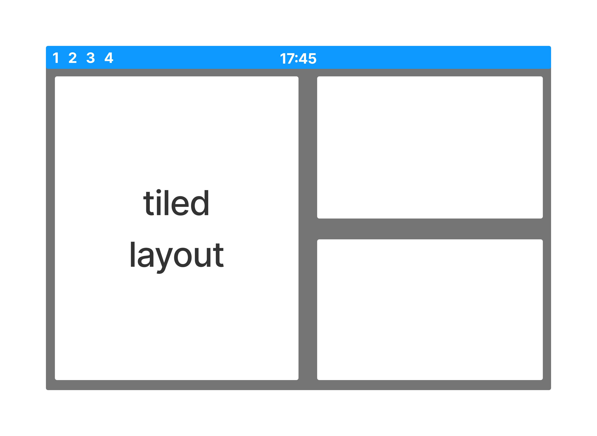
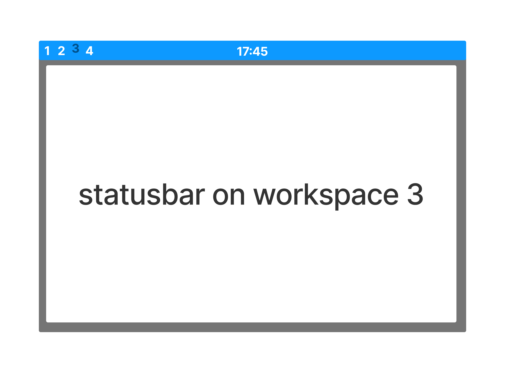

.. _hmi:

============
HMI behavior
============

The individual components and their behavior in certain situations are shown below.

.. hint::
    If the diagrams are not shown big enough to read, please click on them.

Horizontal layout
-----------------

    horizontal layout

Vertical layout
---------------

.. figure:: ../../../../planning/hmi_mocks/layout_vertical.png
    :align: center
    :width: 80%

    vertical layout

Tiled layout
------------

    tiled layout

Workspaces in statusbar
-----------------------

    workspace 3 is active