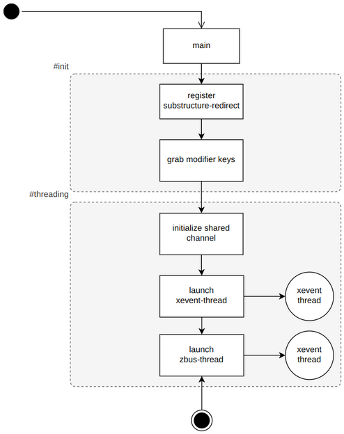
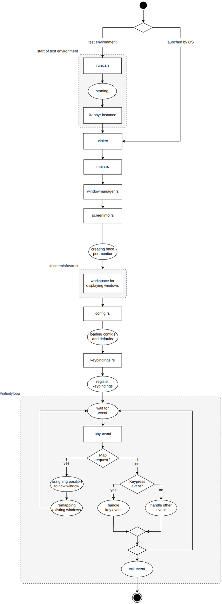
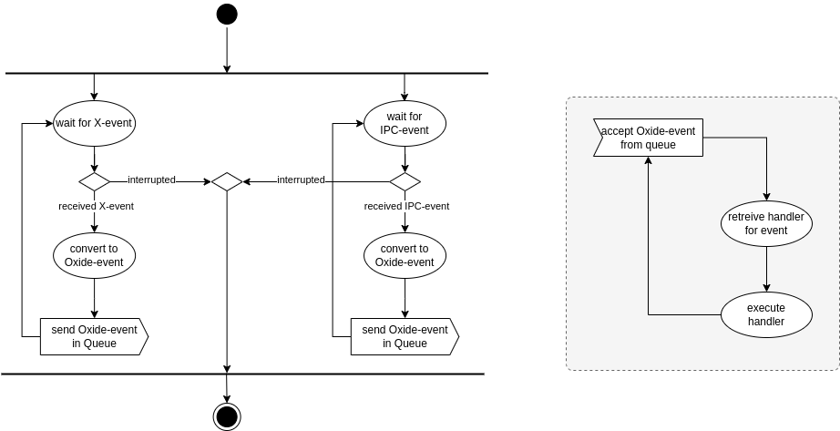
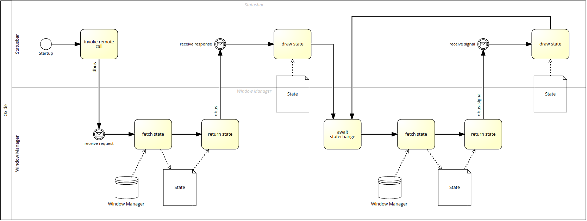
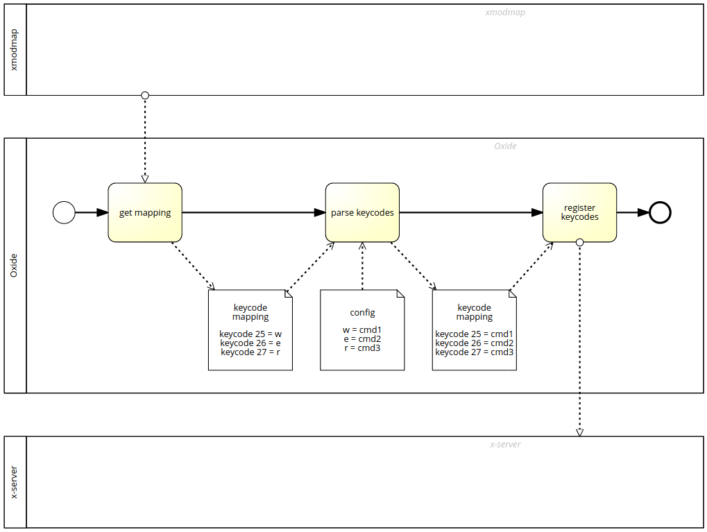
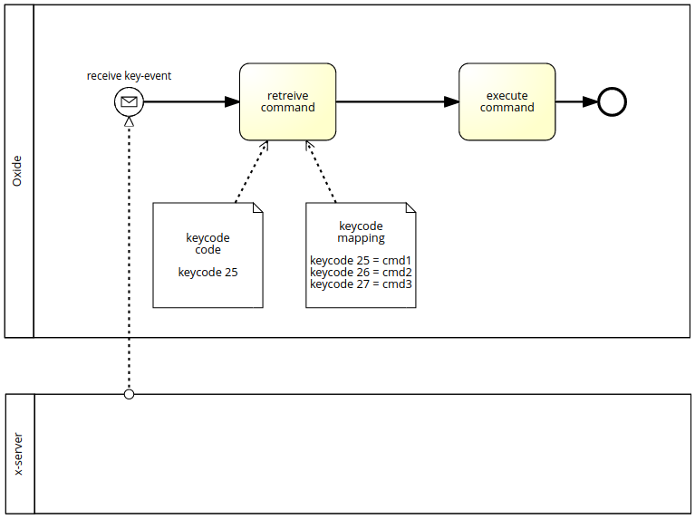

.. _flowcharts:

==========
Flowcharts
==========
The following flowcharts show the technical structure and sequence of the product.

.. hint::
    If the diagrams are not shown big enough to read, please click on them.

Main event loop
---------------

    main event loop

Instantiation
-------------

    instantiation

Eventhandling
-------------

    
    eventhandling

Communication window manager and statusbar
------------------------------------------

    window manager and statusbar communicating

Register keybinds
-----------------

    register keybinds

Getting associated keybind when key pressed
-------------------------------------------

    associated keybind for pressed key

