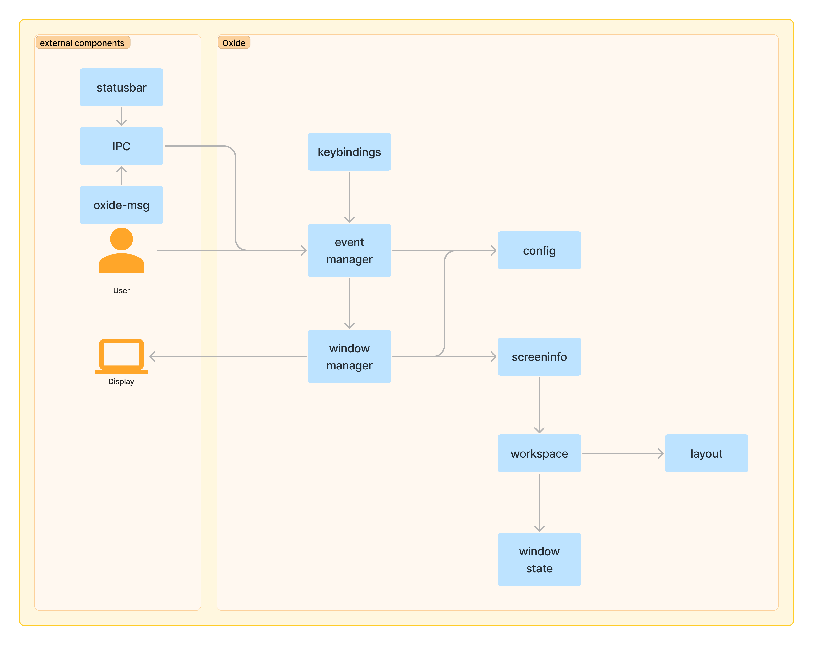
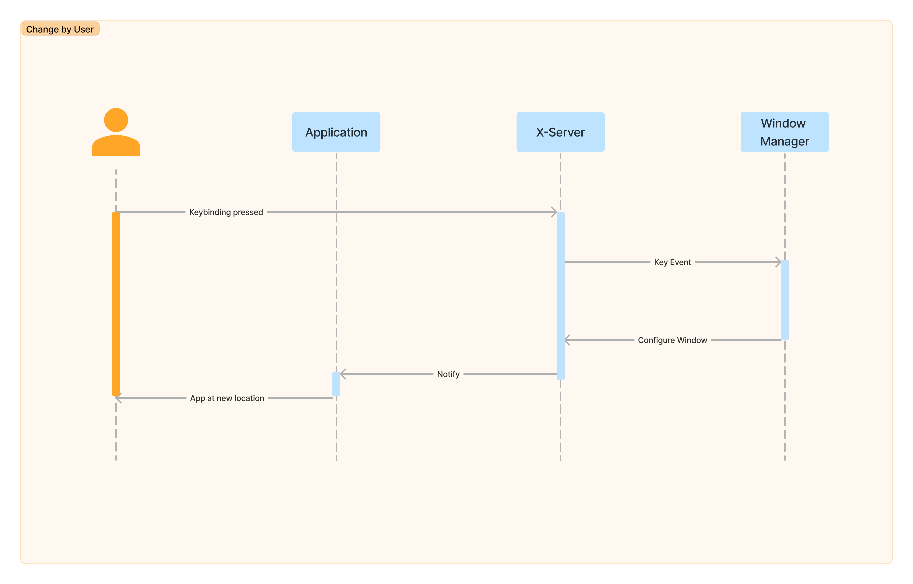
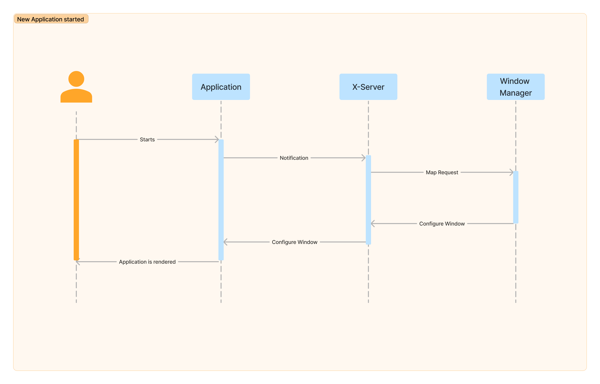

.. _components_behaviour:

=================================
Components and behaviour diagrams
=================================
The individual components and their behavior in certain situations are shown below.

Components
----------

    components

Change request
--------------

    behaviour while incoming change request

New application
---------------

    behaviour when new application is demanded

