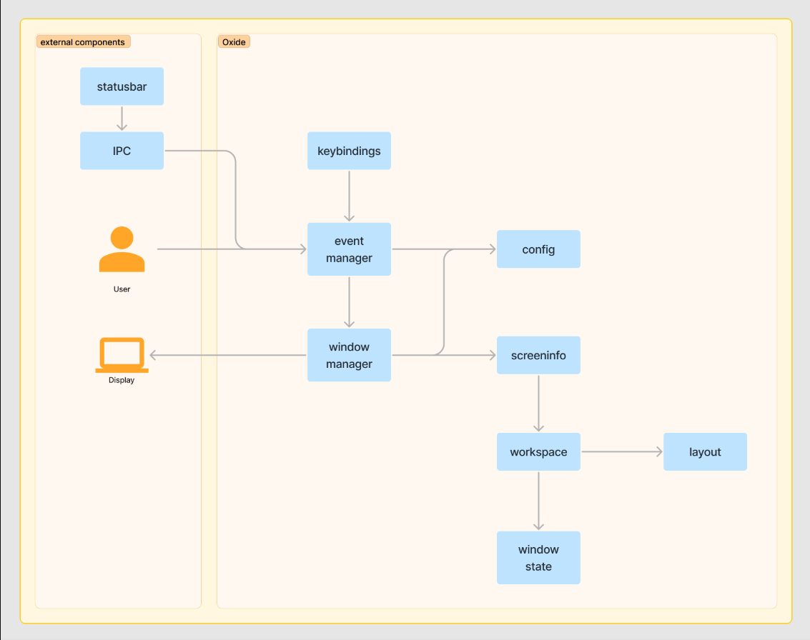

.. _topics-index:

OxideWM documentation
=====================

OxideWM is a tiling window manager for X11. It is written in Rust and uses X11rb.
This project idea is inspired by 10DWM, leftWM and i3WM.

Contents
--------

.. toctree::

        Home <self>
        installation
        concepts
        config
